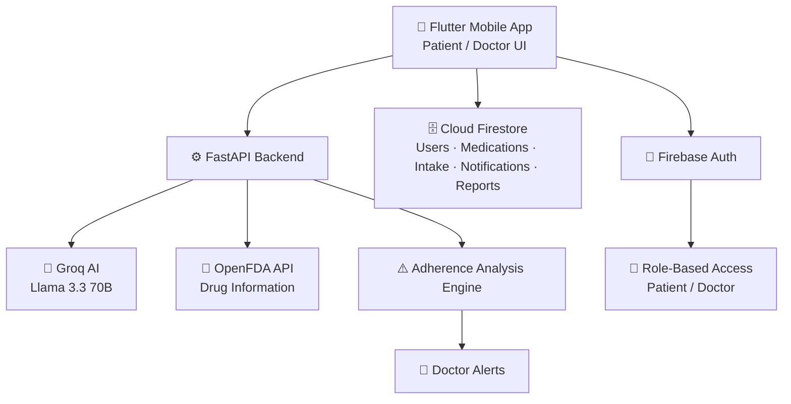

<div align="center">
  <h1>💊 AI-DPMMS — AI-Driven Personalized Medication Management System</h1>

  <p>
    <strong>An AI-Driven Personalized Medication Management System for patients and their doctors</strong>
  </p>

  [](https://flutter.dev)
  [](https://firebase.google.com)
  [](https://dart.dev)
  [](https://fastapi.tiangolo.com)
  [](https://www.python.org)

  [](#-license)
  [](https://github.com/ShahdNammari/ai-dpmms-app)

</div>

---

## 📋 Table of Contents

- [🎯 Overview](#-overview)
- [❓ Problem Statement](#-problem-statement)
- [✨ Features](#-features)
- [🛠️ Technical Stack](#️-technical-stack)
- [🏗️ Architecture](#️-architecture)
- [🗂️ Data Model & Roles](#️-data-model--roles)
- [🚀 Getting Started](#-getting-started)
- [📱 Demo](#-demo)
- [🔮 Future Work Roadmap](#-future-work-roadmap)
- [👨‍💻 About the Developer](#-about-the-developer)
- [🤝 Contributing](#-contributing)
- [📄 License](#-license)

---

## 🎯 Overview

**AI-DPMMS** is a full-stack system that combines a Flutter mobile app, a FastAPI backend, and Firebase cloud services to help patients — especially those managing chronic conditions or multiple medications — stay consistent with their treatment, and to give doctors real-time visibility into adherence between visits.

The app supports two roles — **Patient** and **Doctor** — each with a dedicated experience, and is fully localized in **Hebrew, English, and Arabic** (with RTL/LTR support and light/dark themes).

---

## ❓ Problem Statement

Medication adherence is one of the key factors in treatment success and quality of life. Yet many patients — particularly chronic patients and those on multiple concurrent medications — struggle to consistently follow their treatment plan. According to the WHO, adherence to long-term therapies among chronic patients in developed countries averages only around **50%**.

This commonly leads to:

- Missed doses and dosage errors that go unnoticed until the next appointment
- Doctors relying mainly on patients' self-reporting, which isn't always accurate
- No real-time way to identify patients at risk of treatment failure
- Existing apps that focus narrowly on reminders, without adherence tracking, reporting, or AI support in one place

AI-DPMMS addresses this with a modular system that combines medication management, continuous adherence tracking, automated risk alerts for doctors, and AI-based, personalized medical information for patients.

---

## ✨ Features

### 🔐 Authentication & Roles

- Firebase Authentication (Email/Password)
- Role-based access control: **Patient** and **Doctor**
- Profile & settings management

*(screenshot coming soon)*

---

### 💊 Medication Management (Patient)

- Add, edit, and delete medications with dosage, schedule, and repeat days
- **Medication Versioning** — tracks the history of changes to a patient's treatment plan
- Daily intake tracking: mark doses as **Taken / Skipped / Missed**
- Local notifications/reminders for doses, including exact-alarm and battery-optimization handling on Android

*(screenshot coming soon)*

---

### 🩺 Patient Oversight (Doctor)

- Patient roster with adherence overview
- Per-patient detail view: medications, adherence history, and reports
- Send messages/recommendations to patients

*(screenshot coming soon)*

---

### 🤖 AI Assistant & Adherence Alerts

- AI medical assistant for patients and doctors, powered by **Groq (Llama 3.3 70B)** combined with drug data from the **OpenFDA API**, for personalized, reliable answers
- Automated adherence analysis engine: computes adherence percentage and generates **critical/warning** alerts for doctors when a patient's adherence drops below a defined threshold
- Language-aware responses (Hebrew, English, Arabic)

*(screenshot coming soon)*

---

### 📊 Reporting

- Adherence reports and statistics (daily/weekly/monthly) for patients and doctors
- Export/share reports as PDF

*(screenshot coming soon)*

---

### 🎨 UI/UX

- Light and dark themes
- Full Hebrew/English/Arabic localization with RTL/LTR support

*(screenshot coming soon)*

---

## 🛠️ Technical Stack

<table>
<tr>
<td><strong>📱 Mobile</strong></td>
<td>Flutter (Dart) - single codebase for Android & iOS, patient & doctor interfaces</td>
</tr>
<tr>
<td><strong>☁️ Cloud</strong></td>
<td>Firebase Authentication (identity & role-based access) + Cloud Firestore (users, medications, adherence, notifications, reports)</td>
</tr>
<tr>
<td><strong>⚙️ Backend</strong></td>
<td>FastAPI (Python) - REST API, business logic, authentication flows, AI integration, adherence analysis, report generation</td>
</tr>
<tr>
<td><strong>🤖 AI</strong></td>
<td>Groq API (Llama 3.3 70B) for medical Q&A and adherence-alert generation</td>
</tr>
<tr>
<td><strong>💊 Drug Data</strong></td>
<td>OpenFDA API - verified information on medications, interactions, warnings, and side effects</td>
</tr>
<tr>
<td><strong>🗄️ Local DB</strong></td>
<td>SQLite (SQLAlchemy) - internal backend data management</td>
</tr>
</table>

### 📦 Key Dependencies

```yaml
# mobile/pubspec.yaml
dependencies:
  firebase_core: ^3.6.0 # Firebase SDK
  firebase_auth: ^5.3.1 # Authentication
  cloud_firestore: ^5.5.0 # Database
  flutter_local_notifications: ^17.2.2 # Medication reminders
  flutter_timezone: ^3.0.0
  timezone: ^0.9.2
  table_calendar: ^3.1.2 # Schedules
  pdf: ^3.11.0 # Report generation
  printing: ^5.13.4
  share_plus: ^10.0.2 # Report sharing
  google_fonts: ^6.2.1
  shared_preferences: ^2.3.3 # Local app settings
  http: ^1.2.0 # Talks to the FastAPI backend
```

```txt
# requirements.txt
fastapi==0.128.0
uvicorn==0.40.0
sqlalchemy==2.0.45
httpx              # Groq / OpenFDA HTTP calls
python-jose[cryptography]  # JWT auth
passlib, bcrypt    # Password hashing
```

---

## 🏗️ Architecture

AI-DPMMS uses a **Client–Server architecture** that separates the UI layer, business logic, and data layer — improving security, maintainability, and future extensibility.

<div align="center">



</div>

- **Flutter (UI layer)** — cross-platform interface with separate patient and doctor experiences
- **Firebase Auth** — user authentication and role-based access control
- **Cloud Firestore** — real-time NoSQL storage for medications, adherence, notifications, and reports
- **FastAPI backend** — REST API handling business logic, authentication, AI integration (so API keys are never exposed to the client), and adherence analysis
- **Groq + OpenFDA** — AI medical assistant and adherence-alert generation, grounded in verified drug data

---

## 🗂️ Data Model & Roles

**Firestore collections**

| Collection | Description |
| --- | --- |
| `users` | User ID, name, email, role (Patient/Doctor), profile details |
| `medications` | Per-patient medication list: dosage, schedule, start/end dates, repeat days, version history |
| `daily_intake` | Daily Taken/Skipped/Missed status per medication, used to compute adherence |
| `notifications_inbox` | Reminders, doctor messages, and system notifications |
| `alerts` | Doctor-facing alerts for significant adherence drops or other risk conditions |

**Role-based access**

| Role | Core permissions |
| --- | --- |
| **Patient** | Manage medications, record intake, view reports, receive notifications, use the AI assistant, update profile |
| **Doctor** | View patient roster, adherence data and reports, receive alerts, respond via the doctor interface |

---

## 🚀 Getting Started

### Prerequisites

- **Flutter SDK** (3.10+ per `mobile/pubspec.yaml`)
- **Python 3.11+**
- **Firebase project** for Authentication and Firestore
- **Groq API key** for the AI service

### 1. Mobile app

```bash
cd mobile
flutter pub get
flutter run
```

Firebase must be configured (`lib/firebase_options.dart`, `google-services.json` for Android) before auth/Firestore features will work.

### 2. Backend

```bash
python -m venv .venv
.venv\Scripts\activate
pip install -r requirements.txt
```

Create a `.env` file in the project root:

```
GROQ_API_KEY=your_key_here
```

Run the service:

```bash
uvicorn main:app --reload
```

The API is available at `http://localhost:8000` (`GET /api/health` to verify). The mobile app's `chat_service` and `alert_service` call this backend over HTTP, so it must be reachable from the device/emulator running the app.

---

## 📱 Demo

<div align="center">

### 📸 Key Features Preview

| Feature | Screenshot | Description |
| --- | --- | --- |
| 🔐 **Authentication** | *(coming soon)* | Role-based login for patients and doctors |
| 💊 **Medications** | *(coming soon)* | Add/track medications, versioning, and reminders |
| 🤖 **AI Assistant** | *(coming soon)* | AI chat grounded in OpenFDA drug data |
| 📊 **Reports** | *(coming soon)* | Exportable adherence reports and doctor alerts |

</div>

---

## 🔮 Future Work Roadmap

AI-DPMMS was designed with a modular architecture, making it easy to integrate future technologies and expand the system without major changes to the existing implementation.

| Phase | Focus |
| --- | --- |
| **Phase 1** | 1. Cloud push notifications<br>2. Advanced analytics |
| **Phase 2** | 1. Wearable device integration<br>2. Hospital & EHR/EMR integration |
| **Phase 3** | 1. Predictive AI (trend-based, long-term adherence forecasting)<br>2. Voice assistant |

---

## 👨‍💻 About the Developer

<div align="center">

### **Shahd Nammari**
*Full-Stack Developer | Mobile Application Developer*

</div>

📧 **Email**: sh.m.nammari02@gmail.com

### 🔗 Connect

[](https://github.com/ShahdNammari)

---

## 🤝 Contributing

This is a **private project**. Contributions are not accepted from external developers.

### 📧 Contact

For inquiries regarding this project, please contact:

- **Developer**: Shahd Nammari
- **Email**: sh.m.nammari02@gmail.com

### 🐛 Bug Reports

If you are an authorized user and have found a bug, please reach out directly with:

- Clear description of the problem
- Steps to reproduce
- Expected vs actual behavior
- Screenshots (if applicable)

---

## 📄 License

This project is **proprietary software** — all rights reserved.

```
PROPRIETARY LICENSE

Copyright (c) 2026 Shahd Nammari. All rights reserved.

NOTICE: This software is the exclusive property of the copyright holder.
No permission is granted to use, copy, modify, distribute, or sell this software
without explicit written permission from the copyright holder.

For licensing inquiries, please contact: sh.m.nammari02@gmail.com
```

---

</div>